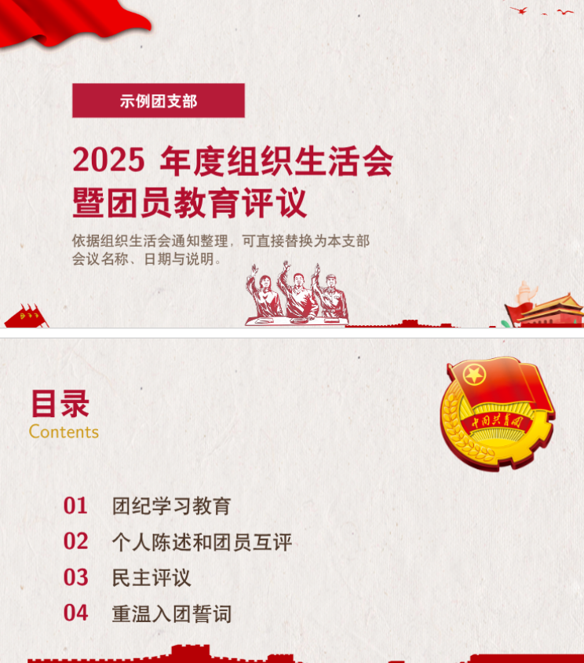

# 团支部幻灯片 LaTeX 模板（tuanyuan template）



简要说明：本目录提供基于 Beamer 的团支部汇报模板与配套样式文件，复用 PPT 拆分出的素材，便于快速生成视觉风格一致的 PDF 幻灯片。

主要文件
- [tuanyuan_template.tex](./tuanyuan_template.tex) — 可直接编辑的模板示例。
- [tuanyuan-beamer.sty](./tuanyuan-beamer.sty) — 核心样式包，定义了页面组件与命令（参见宏：[`\\TYTitlePage`](./tuanyuan-beamer.sty)、[`\\TYAgendaPage`](./tuanyuan-beamer.sty)、[`\\TYAgendaRow`](./tuanyuan-beamer.sty)、[`\\TYSectionPage`](./tuanyuan-beamer.sty)、[`\\TYContentFrame`](./tuanyuan-beamer.sty)、[`\\TYBadge`](./tuanyuan-beamer.sty)）。
- 目录下的辅助文件（`.aux`、`.nav`、`.toc`、`.snm`）为编译产物示例，可忽略或清理。
- [assets/](./assets/) — 模板用到的图片素材（背景、团徽、装饰等）。样式包通过 `\graphicspath{{assets/}}` 引用此目录。

示例


快速使用
1. 将本模板目录完整拷贝到你的工作目录（保持 `assets/` 同级）。
2. 编辑模板中的标题/作者/内容：修改 [tuanyuan_template](./tuanyuan_template.tex) 
3. 编译（推荐 xelatex 或 latexmk）：
   - xelatex:
     ```
     xelatex -interaction=nonstopmode tuanyuan_template.tex
     xelatex -interaction=nonstopmode tuanyuan_template.tex
     ```
   - 或使用 latexmk：
     ```
     latexmk -pdfxe -interaction=nonstopmode [tuanyuan_template.tex](http://_vscodecontentref_/2)
     ```
4. 生成 PDF 后检查图片是否正确加载（若提示找不到图片，确认 `assets/` 在同目录且文件名大小写匹配）。

自定义说明
- 主要可定制的命令与样式位于 [tuanyuan-beamer.sty](./tuanyuan-beamer.sty)。要调整配色、字体或装饰图，优先修改该文件或在主 tex 中通过 \usepackage 后覆写样式。
- 封面/目录/章节/内容页分别由宏 `\TYTitlePage`、`\TYAgendaPage`、`\TYSectionPage`、`TYContentFrame` 生成，直接传参使用或按需复制模板片段。

目前章节页并未实现自动目录功能，需手动设置章节标题和页码。

注意事项
- 保持 UTF-8 编码以避免中文乱码。
- 若在 CI 或无图形环境编译，确保 LaTeX 能访问 `assets/` 中的所有图片或临时移除背景设置。
- 本目录内的 `.aux`、`.nav` 等文件为示例生成文件，非必需，可删除后重新编译生成。

如需将样式应用到其他工程，只需复制 `tuanyuan-beamer.sty` 与 `assets/` 并在你的 tex 文件中添加：
```
\usepackage{tuanyuan-beamer}
```